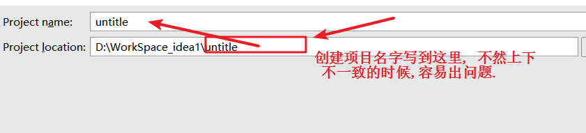
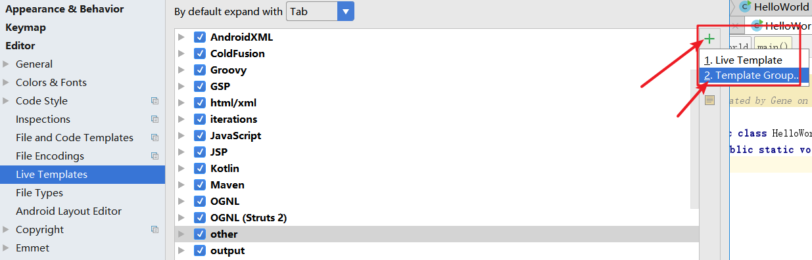

[toc]

# IDEA 安装及配置相关

> **IDEA 的下载地址:** 
>
> [官网](https://www.jetbrains.com/idea/download/#section=windows)    
>
> **IDEA 的旗舰版和社区版区别**
>
> [两个版本对比](https://www.jetbrains.com/idea/features/editions_comparison_matrix.html)   
>
> **官网提供的详细使用文档** 
>
> [使用文档](https://www.jetbrains.com/help/idea/meet-intellij-idea.html) 

# 1.0 window 下载安装过程

> 从安装上来看，IntelliJ IDEA 对硬件的要求似乎不是很高。可是实际在开发中其 
>
> 实并不是这样的，因为 IntelliJ IDEA 执行时会有大量的缓存、索引文件，所以 
>
> 如果你正在使用 Eclipse / MyEclipse，想通过 IntelliJ IDEA 来解决计算机的卡、 
>
> 慢等问题，这基本上是不可能的，本质上你应该对自己的硬件设备进行升级**。**

> **idea 创建项目容易出现的问题**  
>
> 

# 

# 2.0 IDEA 常用配置

## 2.1 常用基本设置

## 2.2 快捷键设置

> 可以通过导入 jar 包的方式,把 idea 的快捷键映射改为  eclipse 的快捷键

> **与eclipse不一致的代码模板:** 
>
> ```js
> psvm   // 生成主函数
> 
> sout   // 打印
> soutp
> soutm
> soutv
> xxx.sout
> ```
>
> > **for 循环模板三** 
>
> ```js
> fori
> iter  增强for循环
> itar 
> 
> ```
>
> **list 集合遍历** 
>
> ```js
> list.for
> list.fori
> list.forr    // reverse 倒序遍历
> ```
>
> **条件判断模板五** 
>
> ```js
> ifn   是否为 null
> // 变形
> ifnn   // 是否不为空
> 
> xxx.null   // 为空
> xxx.nn    // 不为空
> ```
>
> **模板六** 
>
> ```js
> prsf   //  private static final
> 
> // 
> psf     // public static final
> 
> // 
> psfi   // private static final int
> 
> // 
> psfs    // private static final String
> ```

## 2.3 修改及自定义模板

> > **修改原有的 templates**  
>
> **file --  settings ---> Live Templates  ---> 右边的 other 选项里面可以找到对应的 其他一些代码模板**  
>
> **可以把 psvm ---> 修改为  main**  来生成主函数
>
> ```java
> 
> public static final int $VAR1$ = $VAR2$;
> $END$
> // 这种修改方式,可以使得 按回车键的时候, 鼠标按照变量的顺序跳动, 最后跳到 $END$  的位置.
> ```

> **自定义 templates**  
>
> ```js
> 自定义代码模板,首先需要在 idea 的 LIveTemplates 里面添加一个自己定义的代码模板的  # 组 如: custom
> 
> 然后在 custom 的组里面添加 代码模板.
> ```
>
> 

# 3.0 IDEA中添加 Tomcat镜像,并部署文本工程

> Idea 中 添加 Tomcat, 并且部署 web 工程的实现
>
> idea 教程中**视频 14 详解**

**Tabbar中  Run** 

> Edit Configuration 中


######  刚开始看 视频 15


