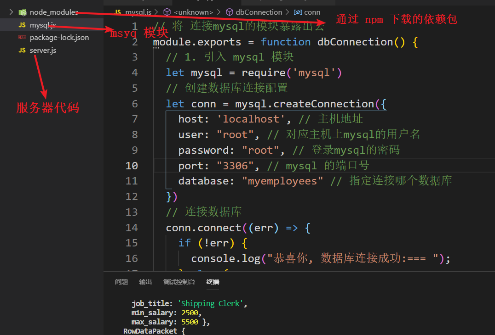

[TOC]

# Node相关

## Node 连接MySQL数据库

> **搭建连接mysql数据库的结构**  
>
> 

> 1. **下载 express 框架搭建服务器** `npm install express`
>
> 2. **创建 server.js 写服务器代码**  
>
> ```js
> //1. 引入 express
> let express = require('express')
> // 引入连接数据库的模块
> let dbConn = require('./mysql.js')
> //2. 创建一个 app 程序
> let app = express()
> 
> //3. 注册路由
> app.get('/',(request,response) => {
>   response.send("<h2>我是后端服务器的根路由</h2>")
> })
> app.get('/login',(request,response) => {
>  response.send("我是login一级路由")
> })
> //4. 绑定端口监听
> app.listen('5000',(err) => {
>  if (!err) {
>    console.log("服务器启动成功, 端口号为5000,地址为: http://localhost:5000");
>    // 服务器启动成功后 连接数据库
>    dbConn()
>  }else{
>    console.log("服务器启动失败:  ");
>  }
> })
> ```
>
> 3. **创建一个 mysql.js 文件, 配置连接数据库的代码** 
>    - **下载 mysql 模块**  `npm  install mysql `
>
> ```js
> // 将 连接mysql的模块暴露出去
> module.exports = function dbConnection() {
>   // 1. 引入 mysql 模块
>   let mysql = require('mysql')
>   // 创建数据库连接配置
>   let conn = mysql.createConnection({
>     host: 'localhost', // 主机地址
>     user: "root", // 对应主机上mysql的用户名
>     password: "root", // 登录mysql的密码
>     port: "3306", // mysql 的端口号
>     database: "myemployees" // 指定连接哪个数据库
>   })
>   // 连接数据库
>   conn.connect((err) => {
>     if (!err) {
>       console.log("恭喜你, 数据库连接成功:=== ");
>     } else {
>       console.log("很抱歉,数据库连接失败:=== " + err);
>     }
>     // 执行 sql 语句
>     const sql = "select * from jobs"
>     conn.query(sql, (err, rows, fields) => {
>       if (!err) {
>         console.log(rows);  // rows 表示 数据库表中的一行数据
>         //console.log(fields); // fields 表示数据库表的 列字段
>          return rows
>       } else {
>         console.log("query查询失败: " + err);
>       }
>     })
>     // 关闭数据库连接
>     // connection.end((err) => {
>     //  if (err) {
>     //    return;
>     //  }
>     //  console.log("数据库成功关闭");
>     // })
>   })
> }
> ```
>
> 4. **下载 nodemon , 用 nodemon server.js 启动服务器** 
>
> ```js
> // 下载 nodemon , 用 nodemon server.js 启动服务器, 这样就可以 在修改 服务器代码时, 自动重启服务器, 不用我们每次 再手动重启服务器
> ```


